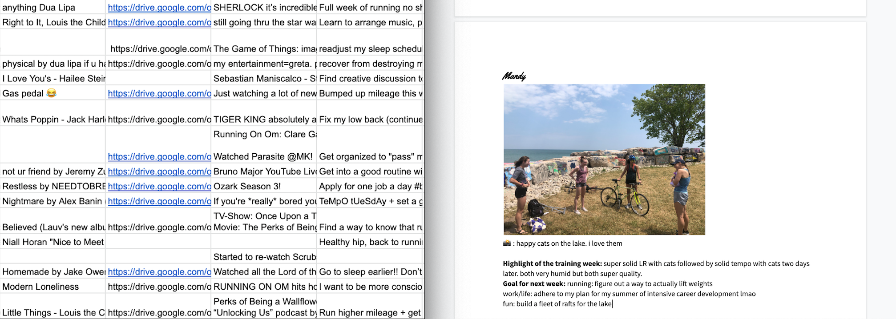

# A neatly formatted compilation of Google Forms responses at the click of a button

## The motivation
When my collegiate cross country team was suddenly spread out across the country due to the Coronavirus pandemic, we wanted a fun way to keep up with what everyone was up to week-to-week. Gathering responses from a Google Form was easy, but shaping those responses into an aesthetically pleasing newsletter required a lot of copy and pasting, highlighting, clicking, and repeating. 

Aware that Google Apps Script existed, I thought, *there must be a way to automate this*. Turns out there is, and I tinkered around until I made it work. Now my teammate who's in charge of this newsletter can click a button and have the formatted components of the newsletter in her inbox. Instead of hundreds of clicks to make the newsletter formatted as desired, **2-3 total copy-and-pastes** are all that's needed to insert the automatically formatted newsletter contents into our template. 

## Features
* **UI:** includes an 'Automatic Newsletter' button on the toolbar, user inputs for the starting Sheets row for the current week's submissions, and the email address to send the finished result to. 

* **A simple countdown calculator**. The first thing appended to the resulting Google Doc is the number of days until the Big Ten Cross Country Championships (from the date that the newsletter is generated). 
* **Image Handling & bios**: Works with Google Drive to retrieve all of the images that were submitted and formats them within each person's bio. Works for when people submit multiple photos. Sends an email containing the Drive links to any images/videos that are unsupported file types (e.g., .mov or .heic).  
* **Simple lists, not so simple questions**: The next main output is a page dedicated to each open-ended question of the week. The question is printed out as a header, followed by a bulleted list of the responses. Each response is followed by the name of the person who submitted it in brackets. Our questions sometimes change week-to-week, but we use the same Google Form (and the sheet it's linked to) for ease, so selection of only the relevant questions is done programmatically. The only manual step is ensuring there is an 'X' in the cell below the desired questions within the sheet.
* **Styling**: The greatest time saver. Fonts, bolding, colors, etc, all taken care of automatically. 

